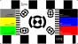

## Photo scales
**5 November 2025**

I was looking for photo scales some time back, and wanted something fully public domain. I found quite a few with open source licenses, but I needed something I could use for personal or commercial use.

 
This is sized to fit on a standard 3.5 × 2-in US business card, and is released [CC0](https://creativecommons.org/public-domain/cc0/) public domain. I've made some branded versions for work, and for personal brands. The [SVG](images/scale_refmark_bizcard_ess.svg) should scale automatically to size, but if it doesn't you can always rescale manually -- and be sure to check your printer prints true to size before using any scale. There is also a [PNG](images/scale_refmark_bizcard_ess.png) version if you can't use SVG.

*This was previously published [on my SDF page](http://the.fedora.sdf.org/SGC/).*
